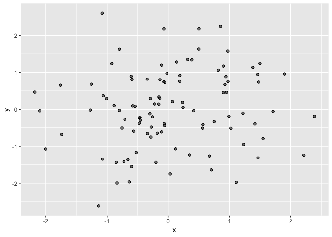
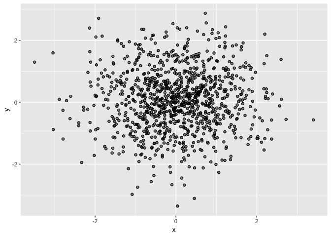

Trying MD File
================
Rolando J. Acosta

# Does this work?

Hey you, I want to check if creating an md file locally and then
updating it to the repo will properly convert. Here I’m plotting the
distribution of points for the three players in the regular season.

``` r
set.seed(5)
x <- rnorm(100)
y <- rnorm(100)

ggplot() +
  geom_point(aes(x, y), alpha = 0.50) +
  geom_point(aes(x, y), pch = 1)
```

<!-- -->

Now, this is the distribution of points but during the playoff. Again,
considering all three players:

``` r
set.seed(5)
x <- rnorm(1000)
y <- rnorm(1000)

ggplot() +
  geom_point(aes(x, y), alpha = 0.50) +
  geom_point(aes(x, y), pch = 1)
```

<!-- -->
